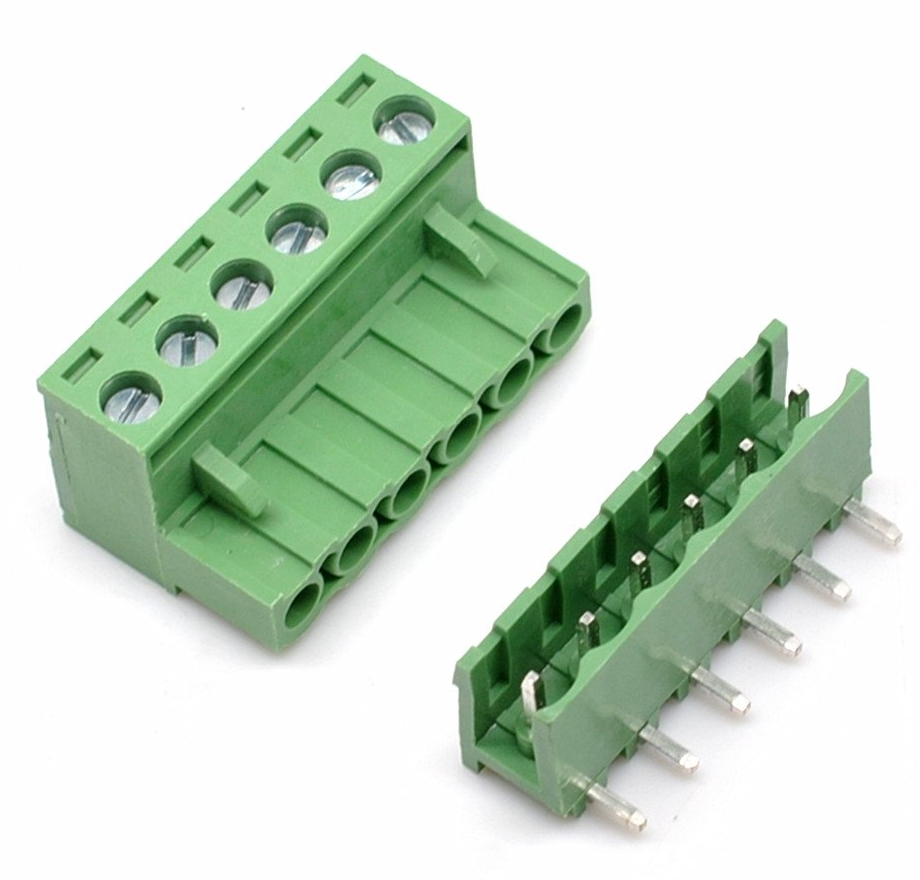

# easyATnoX

## Introduction

The easyATnoX is my modified version of of hkzlab's [ATnoX](https://github.com/hkzlab/ATnoX), which was born out of the need to have a small adapter to fit AT/XT motherboards into modern cases to power them with ATX power supplies and turn them on with a push button (the standard power button found in computer enclosures of the last 20+ years).

It is a cost-effective alternative to the [ATX2AT Smart Converter](https://x86.fr/atx2at-smart-converter/), which has a great range of functions, but functions that are not always needed, especially if it is simply a matter of operating an old mainboard in the end.

The easyATnoX is, as the name suggests, a simplified version of the [ATnoX](https://github.com/hkzlab/ATnoX) with a few important changes. In addition, it should be even cheaper to purchase/production.

:warning: | The PCB is untested so far. Furthermore, I assume no liability for any damages. Use at your own risk.
:---: | :---

...but reviews, feedback and fixes are absolutely welcome! 😉

## Changes are ...

- Two PCB copies were accommodated on the area of 100 x 100 mm and separated by means of mouse bites. An easyATnoX therefore has the dimensions of approximately 100 x 50 mm. The background to this is the $2 PCB offer from JLCPCB.
- The 4 layer PCB became a 2 layer PCB.
- SMD and SMT components replaced by through-hole components as far as possible.
- Diagnostic LED's for the voltages have been removed
- The 14-pin ATX2AT connector was removed and replaced by detachable screw terminals. The pin assignment corresponds to the pin assignment of the original AT power cables (P8 and P9). The reason for this is that in this way the two power cables (P8 and P9) from an old AT power supply unit can simply be cut off, fitted with wire end ferrules and screwed to the screw terminals.
- Components are now only to be installed single sided.
- [Fabrication files](/KiCAD/jlcpcb/) for JLCPCB including [BOM](/KiCAD/jlcpcb/assembly/BOM-MouseBite.csv) have been generated!

## Untouched features

- -5v onboard generation via a 7905 regulator
- Momentary button power-on support
- Header for power led in case the motherboard lacks it
- Power on button included on board for bench testing
- Optional amiga Tick generator (also via removable screw terminal)

## ToDo's

- **Test, test and test again!** Please let me know if you are using this PCB and have encountered a problem. Also if you simply have a feature request.
- **Designing an easy to assemble and mount enclosure for 3D printers.**

## Screw terminal type

## Pinout

## Component list

Production files for JLCPCB including BOM [can be found here](/KiCAD/jlcpcb/).

## Credits

- Many thanks to [khalil_28](https://www.fiverr.com/khalil_28) who implemented all these changes for me!
- ATnoX taken from [hkzlab/ATnoX](https://github.com/hkzlab/ATnoX)
  - logic-4000 libraries taken from [alexisvl/kicad-schlib](https://github.com/alexisvl/kicad-schlib)
  - ATX power-on circuit taken from [skiselev/isa8_backplane](https://github.com/skiselev/isa8_backplane)
  - Amiga Tick generator taken from [Aminet](http://aminet.net/package/docs/hard/Mix_and_Tick)
